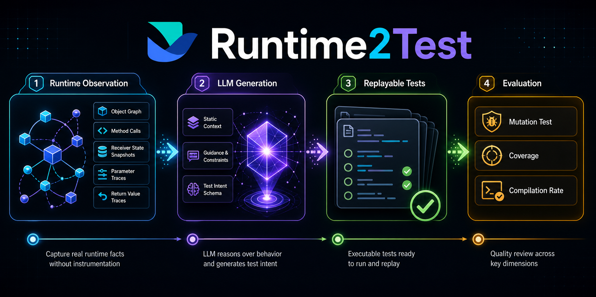
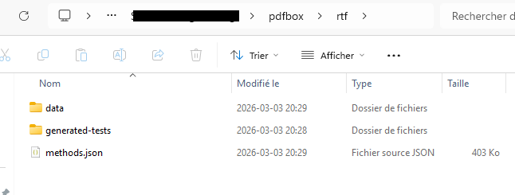

<div align="center">
  <h1>Runtime2Test</h1>
  
</div>

`Runtime2Test` is a tool that automatically converts real-world Java object behaviors during runtime into replayable test code. We utilize a combined approach of ProDJ + LLM. The objective is to generate test cases that are grounded in production-level workloads and realistic scenarios.

Reference: [Serializing Java Objects in Plain Code](http://arxiv.org/pdf/2405.11294) (Julian Wachter, Deepika Tiwari, Martin Monperrus and Benoit Baudry), Journal of Software and Systems, 2025.

```bibtex
@article{2405.11294,
 title = {Serializing Java Objects in Plain Code},
 journal = {Journal of Systems and Software},
 year = {2025},
 doi = {10.1016/j.jss.2025.112721},
 author = {Julian Wachter and Deepika Tiwari and Martin Monperrus and Benoit Baudry},
 url = {http://arxiv.org/pdf/2405.11294},
}
```

## Setup

**Prerequisites:** JDK 17+, Maven 3.8+

The easiest way to get an executable version of `Runtime2Test` is to use the provided `flake.nix`:
1. Enter a dev-shell using `nix develop`
2. Build: `mvn -DskipTests package`
3. Run: `java -jar runtime2test-engine/target/runtime2test-engine.jar --statistics <config file>`

You can find example config files in `runtime2test-engine/src/test/resources/`.

---

## Running with PDFBox (Step-by-Step)

**Environment tested on:**
- Maven: Apache Maven 3.9.12
- Java: OpenJDK 17
- Windows x64 / Linux / Mac

### Step 1: Build Runtime2Test

```bash
mvn -DskipTests package
```

Output: `runtime2test-engine/target/runtime2test-engine.jar`

This JAR serves as both the main executable and the Java Agent.

### Step 2: Clone and build PDFBox

```bash
git clone https://github.com/apache/pdfbox.git -b trunk
cd pdfbox
mvn -DskipTests package
```

### Step 3: Copy the test PDF

Copy `runtime2test-engine/src/test/resources/CodeMonkey.pdf` to the **root directory of the PDFBox project** (the same folder where you will run PDFBox from).

### Step 4: Create a config file

Choose the config that matches your OS. Example configs are in `runtime2test-engine/src/test/resources/`.

**Linux/Mac** — create your own based on `pdfbox.json`:

```json
{
  "filterTests": true,
  "ignoreCoverage": true,
  "usedEquality": "ASSERT_J_DEEP",
  "projectPath": "/absolute/path/to/pdfbox",
  "methodsJson": "/tmp/rtf/methods.json",
  "dataPath": "/tmp/rtf/data",
  "testBasePath": "/tmp/rtf/generated-tests/src/test/java",
  "productionCommand": "'/absolute/path/to/Runtime2Test/runtime2test-engine/src/test/resources/run_pdfbox.sh' {{agent_call}}"
}
```

**Windows** — use or adapt `pdfbox_windows.json`:

```json
{
  "filterTests": true,
  "ignoreCoverage": true,
  "usedEquality": "ASSERT_J_DEEP",
  "projectPath": "C:/path/to/pdfbox",
  "methodsJson": "rtf/methods.json",
  "dataPath": "rtf/data",
  "testBasePath": "rtf/generated-tests/src/test/java",
  "productionCommand": "call \"C:/path/to/Runtime2Test/runtime2test-engine/src/test/resources/run_pdfbox_windows.cmd\" {{agent_call}}"
}
```

> **Important placeholders:**
> - `{{agent_call}}` — automatically replaced with `-javaagent:runtime2test-engine.jar=methods.json`. Do **not** fill this in manually.
> - `{{config_dir}}` — automatically replaced with the absolute path of the directory containing your config file.

### Step 5: Run data collection and test generation

**Windows:**
```bash
java -jar runtime2test-engine/target/runtime2test-engine.jar --statistics runtime2test-engine/src/test/resources/pdfbox_windows.json
```

**Linux/Mac:**
```bash
java -jar runtime2test-engine/target/runtime2test-engine.jar --statistics /path/to/your/config.json
```

**What happens internally:**

```
1. Read config.json
2. Prepare: Spoon static analysis → writes methodsJson and dataPath/static-snapshot.json
3. Execute productionCommand with Java Agent injected
   → ByteBuddy instruments PDFBox at runtime
   → Runtime data written to dataPath/
4. Generation: read runtime data → generate test files to testBasePath/
```

### Step 6: Run the generated tests

The generated tests are named `*RockyTest.java` and placed under `testBasePath`.

**Windows (PowerShell):**
```powershell
Set-Location 'C:\path\to\pdfbox'
mvn -Dtest=*RockyTest -Dsurefire.failIfNoSpecifiedTests=false test
```

**Linux/Mac:**
```bash
cd /path/to/pdfbox
mvn -Dtest=*RockyTest -Dsurefire.failIfNoSpecifiedTests=false test
```



---

## CLI Options

```
java -jar runtime2test-engine.jar [OPTIONS] <config.json>

Options:
  --statistics              Collect and write statistics to dataPath/stats.json
  --hide-output, -q         Suppress stdout of the instrumented program
  --production-coverage     Enable production coverage tracking
  --print-covered-methods   Print all covered methods after the run
  --run-tests <path>        Run the generated tests after generation
```

---

## Config File Reference

All fields go in the top-level config JSON file.

| Field | Type | Required | Default | Description |
|-------|------|----------|---------|-------------|
| `projectPath` | path | Yes | — | Root directory of the target project (must contain `pom.xml`) |
| `methodsJson` | path | Yes | — | Where to write the InstrumentationConfiguration JSON |
| `dataPath` | path | Yes | — | Directory for all runtime data files |
| `testBasePath` | path | Yes | — | Root directory for generated test files |
| `productionCommand` | string | Yes | — | Command to run the target program; must include `{{agent_call}}` |
| `usedEquality` | string | No | `JUNIT` | Assertion style: `JUNIT` / `ASSERT_J_DEEP` / `DEEP_REFLECTIVE` |
| `filterTests` | boolean | No | `false` | Remove tests that fail to compile |
| `ignoreCoverage` | boolean | No | `false` | Ignore coverage-based filtering |
| `generationMode` | string | No | `RULE_ONLY` | `RULE_ONLY` / `LLM_FIRST_STATIC` / `HYBRID_DYNAMIC` |
| `llmEndpoint` | string | No | — | Full URL of LLM service (required for LLM modes) |
| `llmTimeoutMs` | int | No | `45000` | LLM request timeout in milliseconds |
| `llmMaxRetry` | int | No | `1` | Max LLM request retries |
| `hybridMaxMethods` | int | No | `100` | Max methods included in runtime facts (HYBRID_DYNAMIC) |
| `hybridMaxFactsPerMethod` | int | No | `20` | Max fact entries per method (HYBRID_DYNAMIC) |
| `hybridIncludeRawEvents` | boolean | No | `false` | Include raw event stream in LLM request |
| `hybridEnableRuntimeFacts` | boolean | No | `true` | Collect and send runtime facts (HYBRID_DYNAMIC) |
| `additionalInstrumentedPackages` | string[] | No | `[]` | Extra package prefixes to instrument |

---

## Data Files

All runtime data is written to `dataPath/` in NDJSON format (one JSON object per line).

| File | Written by | Content |
|------|-----------|---------|
| `static-snapshot.json` | Prepare phase | Static code information (classes, methods, fields) |
| `methods.json` | Prepare phase | InstrumentationConfiguration read by the Java Agent |
| `invocations.json` | Java Agent | Top-level MUT invocation records (parameters, return values, receiver state) |
| `nested-invocations.json` | Java Agent | Nested call records |
| `mocked-invocations.json` | Java Agent | Mock object invocation records |
| `events.json` | Java Agent | Low-level event stream (object construction, field writes, method calls) |
| `stats.json` | After generation | Serialized Statistics object (requires `--statistics` flag) |

---

## Generation Modes

### `RULE_ONLY` (default)

Generates tests purely from recorded runtime invocations. No LLM involved.

### `LLM_FIRST_STATIC`

Sends static code information to the LLM to generate tests. Falls back to `RULE_ONLY` if the LLM call fails.

```json
{
  "generationMode": "LLM_FIRST_STATIC",
  "llmEndpoint": "https://<your-domain>/generation"
}
```

### `HYBRID_DYNAMIC`

Sends both static code information and runtime facts (parameter values, return values, object states) to the LLM. Falls back to `RULE_ONLY` if the LLM call fails.

Recommended configs under `runtime2test-engine/src/test/resources/`:

- `pdfbox_windows_hybrid_course.json` — for coursework/stable runs (`hybridEnableRuntimeFacts: false`)
- `pdfbox_windows_hybrid.json` — for research/behavior exploration (`hybridEnableRuntimeFacts: true`)

```bash
# Hybrid mode (research)
java -jar runtime2test-engine/target/runtime2test-engine.jar --statistics runtime2test-engine/src/test/resources/pdfbox_windows_hybrid.json

# Hybrid mode (coursework)
java -jar runtime2test-engine/target/runtime2test-engine.jar --statistics runtime2test-engine/src/test/resources/pdfbox_windows_hybrid_course.json
```

---

## LLM Service Contract

The tool sends an HTTP POST to `llmEndpoint` with `Content-Type: application/json`.

**HYBRID_DYNAMIC request body:**

```json
{
  "mode": "HYBRID_DYNAMIC",
  "projectPath": "/path/to/project",
  "staticSnapshot": "<contents of static-snapshot.json>",
  "runtimeFacts": "<runtime facts JSON>",
  "assertionStyle": "ASSERT_J_DEEP",
  "maxMethods": 100,
  "maxFactsPerMethod": 20,
  "includeRawEvents": false
}
```

**LLM_FIRST_STATIC request body:**

```json
{
  "mode": "LLM_FIRST_STATIC",
  "projectPath": "/path/to/project",
  "staticSnapshot": "<contents of static-snapshot.json>",
  "assertionStyle": "ASSERT_J_DEEP"
}
```

**Expected response:**

```json
{
  "success": true,
  "message": "ok",
  "files": [
    {
      "relativePath": "org/apache/pdfbox/pdmodel/PDDocumentRockyTest.java",
      "content": "package org.apache.pdfbox.pdmodel;\n\npublic class PDDocumentRockyTest { ... }"
    }
  ]
}
```

> If using ngrok or Cloudflare Tunnel, the tool automatically adds the `ngrok-skip-browser-warning` header. No extra configuration needed.

Reference files:
- Contract: `runtime2test-engine/src/test/resources/LLM/RUNTIME2TEST_SERVER_CONTRACT.md`
- Flask adapter example: `runtime2test-engine/src/test/resources/LLM/runtime2test_adapter_example.py`

---

## ProDJ-Aligned Experiment Scripts

For batch LLM experiments over the 79 ProDJ-aligned PDFBox methods.

**Scripts location:** `runtime2test-engine/src/test/resources/LLM/`

**Prerequisites (Lightning AI Studio paths):**

| Path | Content |
|------|---------|
| `/teamspace/studios/this_studio/pdfbox_dataset` | Pre-collected PDFBox runtime data (`dataPath`) |
| `/teamspace/studios/this_studio/pdfbox` | PDFBox source code (`projectPath`) |
| `/teamspace/studios/this_studio/Runtime2Test` | This repository |

**Run batch generation:**

```bash
cd runtime2test-engine/src/test/resources/LLM/

# HYBRID_DYNAMIC, 1 sample per method
bash run_prodj_aligned.sh https://xxxx.trycloudflare.com

# HYBRID_DYNAMIC, 3 samples per method
bash run_prodj_aligned.sh https://xxxx.trycloudflare.com 3

# LLM_FIRST_STATIC, 1 sample per method
bash run_prodj_aligned.sh https://xxxx.trycloudflare.com 1 LLM_FIRST_STATIC
```

Output directory: `/teamspace/studios/this_studio/r2t-output-prodj-aligned-<MODE>-s<SAMPLES>/`

**Merge multi-sample results:**

```bash
python3 merge_tests_by_class.py \
  --input-dir /path/to/r2t-output-prodj-aligned-HYBRID_DYNAMIC-s3 \
  --output-dir /path/to/merged-output
```

---

## About the LLM Integration

The current integration supports any HTTP-compatible LLM service. An example adapter for CodeT5-base (a Transformer-based model for code generation by Salesforce) is provided at `runtime2test-engine/src/test/resources/LLM/runtime2test_adapter_example.py`.

Reference: [Wang, Yue, et al. "CodeT5: Identifier-aware Unified Pre-trained Encoder-Decoder Models for Code Understanding and Generation."](https://aclanthology.org/2021.emnlp-main.685.pdf) EMNLP 2021.

